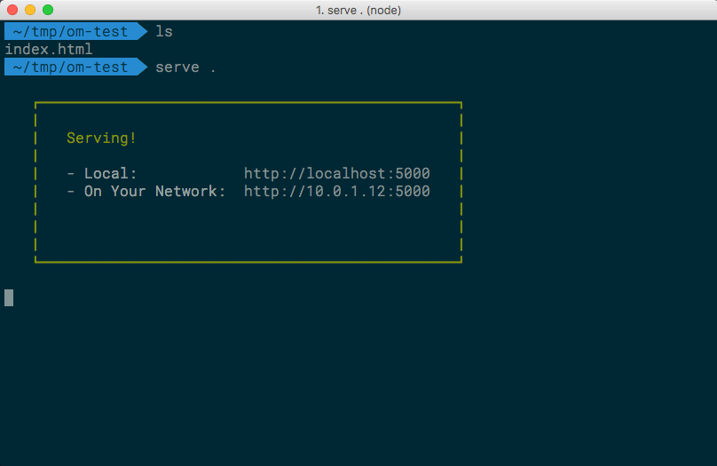
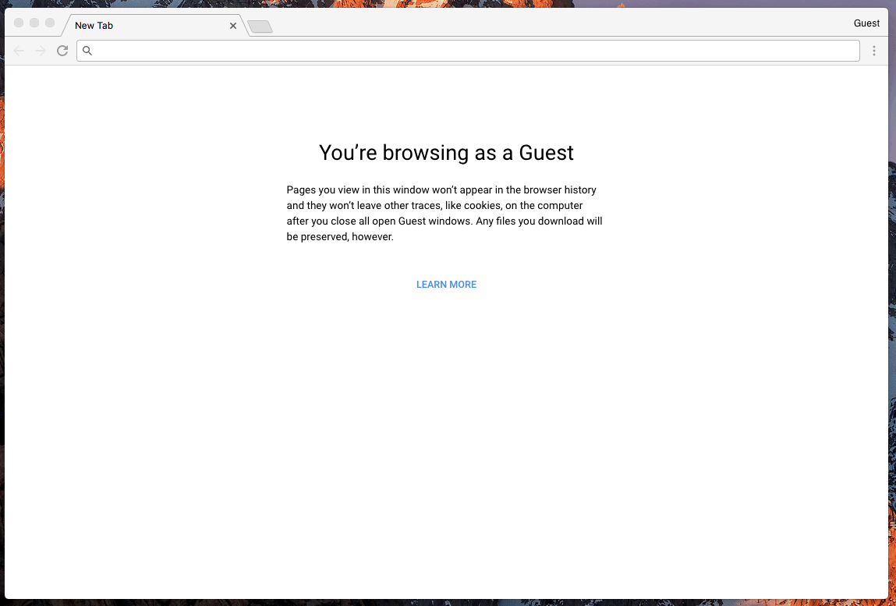

When testing many facets of the OptinMonster embed code I find myself needing a clean & quick HTML page on almost a daily basis. For most tasks throwing some code into [JSFiddle](https://jsfiddle.net) will do, but testing some of our more advanced targeting rules becomes onerous, if not impossible.

In comes a great little NPM package [serve](https://www.npmjs.com/package/serve) from the team over at [Zeit](https://zeit.co/) that gives you a bare-bones web server from the terminal.

So without further ado, my process:

### Install the package
```bash
> npm i -g serve
```

### Create the necessary files
I first create a new temporary directory and add an `index.html` file.

```bash
> mkdir om-test && cd om-test
> touch index.html
```

### Add the HTML
I then place some boilerplate HTML in `index.html` along with the OptinMonster embed code.

```html
<html>
<head><title>OptinMonster Test</title></head>
<body>
	<h1>I'm OptinMonster Testing Rick!</h1>
	<!-- OptinMonster embed code goes here -->
</body>
</html>
```

### Start the server
Back in the terminal and in the temporary directory, start the server with `server .`.



Once you see "Serving!" your page is ready to go!

### View the page
You can now see the test page at [http://localhost:5000](http://localhost:5000).



# That's it.